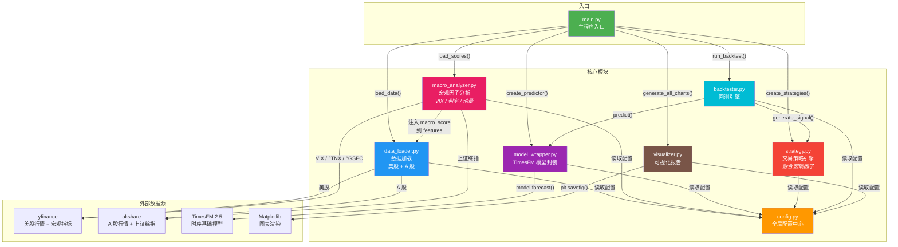
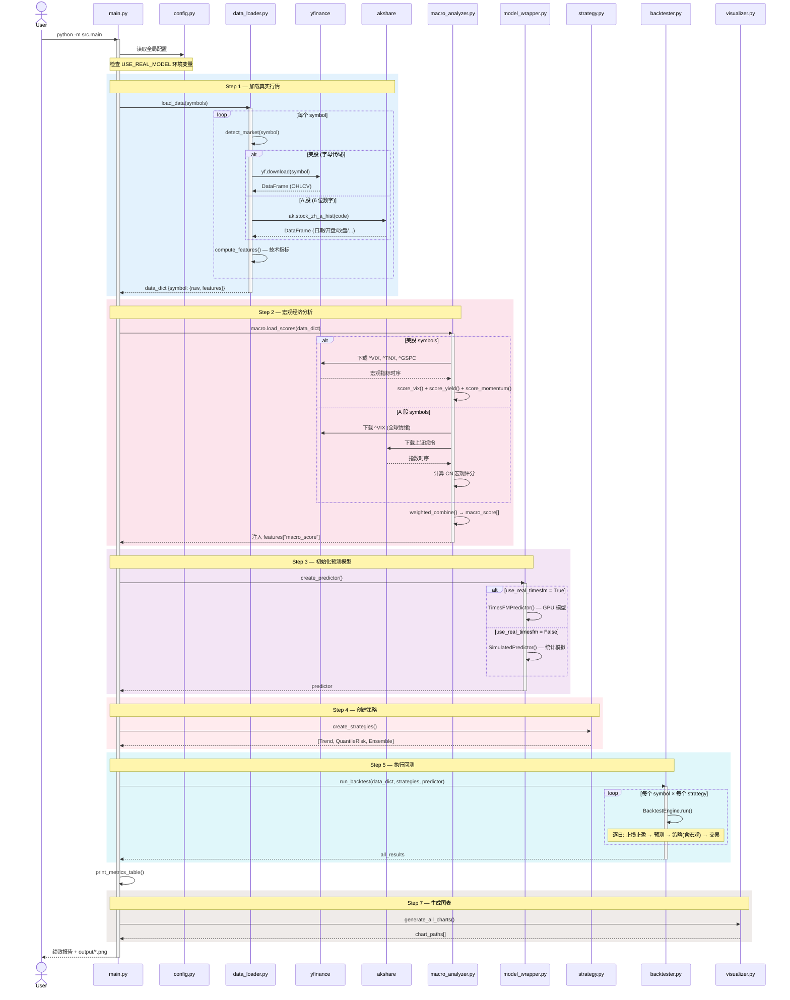
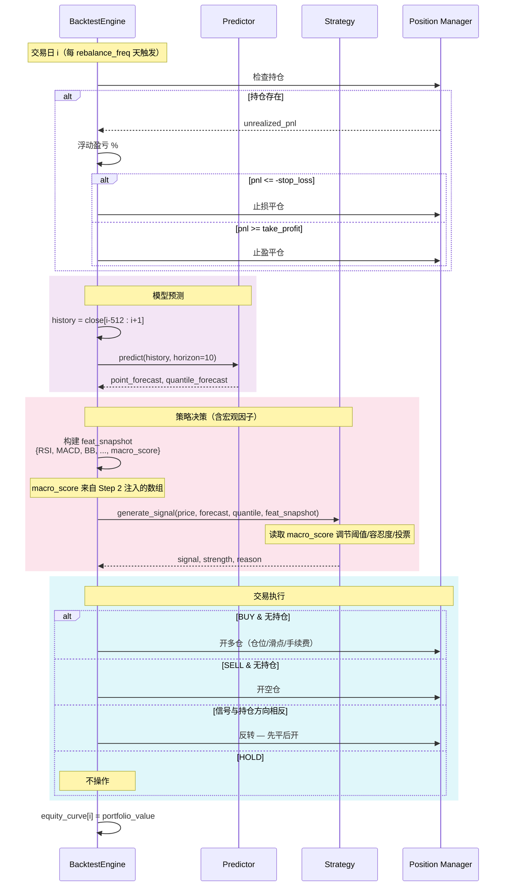
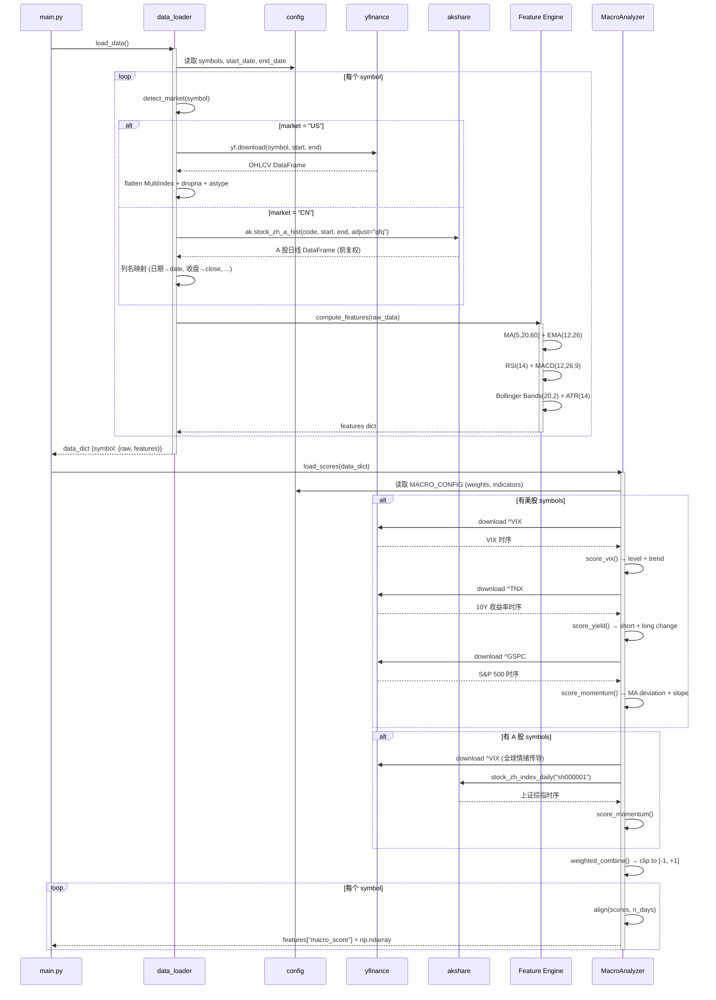

# TimesFM Quant — 基于 TimesFM 2.5 的量化交易回测框架

> 利用 Google Research **TimesFM 2.5**（200M 参数，ICML 2024）时间序列基础模型进行股票价格预测，结合**宏观经济因子**分析，通过多策略回测引擎评估交易表现。同时支持**美股**与**中国 A 股**真实行情数据。

## 目录

- [项目概览](#项目概览)
- [特性](#特性)
- [项目结构](#项目结构)
- [模块关系图](#模块关系图)
- [执行流程图](#执行流程图)
- [核心时序图](#核心时序图)
  - [完整回测时序](#完整回测时序)
  - [单步交易决策时序（含宏观因子）](#单步交易决策时序含宏观因子)
  - [数据加载与宏观分析时序](#数据加载与宏观分析时序)
- [快速开始](#快速开始)
- [配置说明](#配置说明)
- [策略说明](#策略说明)
- [宏观因子模块](#宏观因子模块)
- [输出示例](#输出示例)

---

## 项目概览

本项目将 **TimesFM 2.5**（Decoder-only 时间序列基础模型）应用于量化交易场景，提供从真实行情数据获取、宏观环境评估、模型预测、信号生成、交易模拟到可视化报告的完整链路。

- **美股**通过 [yfinance](https://github.com/ranaroussi/yfinance) 获取（如 AAPL、TSLA）
- **中国 A 股**通过 [akshare](https://github.com/akfamily/akshare) 获取（如 600519 茅台、000858 五粮液）
- 系统自动根据代码格式识别市场，无需手动切换

## 特性

- **双市场真实数据**：美股 yfinance + A 股 akshare，自动识别市场路由
- **宏观因子分析**：VIX 恐慌指数、国债收益率、市场指数动量 → 复合宏观评分 [-1, +1]
- **宏观 × 策略融合**：宏观评分动态调节交易阈值、风控容忍度、投票权重
- **双模式预测器**：真实 TimesFM 模型（GPU）与统计模拟预测器（CPU）
- **三大交易策略**：趋势预测、分位数风控、多 Horizon 集成（均融合宏观因子）
- **完整回测引擎**：手续费、滑点、止损止盈、滚动窗口预测
- **丰富的技术指标**：MA / EMA / RSI / MACD / 布林带 / ATR
- **自动化图表**：6 类图表自动输出到 `output/`

---

## 项目结构

```
timesfm_time/
├── README.md                # 项目文档
├── pyproject.toml            # 依赖管理（uv / pip）
├── uv.lock                   # uv 锁文件
├── .python-version           # Python 版本约束 (3.12)
├── output/                   # 图表输出目录（运行后生成）
└── src/                      # 核心源码包
    ├── __init__.py            # 包初始化
    ├── config.py              # 全局配置中心
    ├── data_loader.py         # 数据加载（美股 + A 股）& 技术指标
    ├── macro_analyzer.py      # 宏观经济因子分析（NEW）
    ├── model_wrapper.py       # TimesFM 模型封装 & 模拟预测器
    ├── strategy.py            # 三种交易策略（融合宏观因子）
    ├── backtester.py          # 回测引擎 & 绩效计算
    ├── visualizer.py          # 可视化图表生成
    └── main.py                # 主程序入口
```

---

## 模块关系图



**模块依赖速查**：

| 模块 | 依赖 | 职责 |
|------|------|------|
| `config.py` | 无 | 全局参数，被所有模块读取 |
| `data_loader.py` | `config` | 自动路由美股/A股，获取真实 OHLCV，计算技术指标 |
| `macro_analyzer.py` | `config`, `data_loader` | 获取宏观指标（VIX / 利率 / 指数），计算每日宏观评分 |
| `model_wrapper.py` | `config` | 封装 TimesFM / 模拟预测器，统一 `predict()` 接口 |
| `strategy.py` | `config` | 三种策略 × 宏观因子调节，输出买/卖/持有信号 |
| `backtester.py` | `config`, `strategy` | 驱动回测循环，管理仓位、交易、绩效指标 |
| `visualizer.py` | `config` | 渲染 6 类 PNG 图表 |
| `main.py` | 所有模块 | 编排完整流程 |

---

## 执行流程图

```mermaid
flowchart TD
    START([启动 main.py]) --> ENV{检查环境变量}
    ENV -->|USE_REAL_MODEL=1| REAL_MODEL[启用真实 TimesFM]
    ENV -->|默认| DEFAULT[模拟预测器 CPU]

    REAL_MODEL --> STEP1
    DEFAULT --> STEP1

    STEP1["<b>Step 1: 加载真实行情</b><br/>load_data()"]
    STEP1 --> DETECT{代码格式检测}

    DETECT -->|字母 AAPL| US_DL["yfinance 下载美股"]
    DETECT -->|6位数字 600519| CN_DL["akshare 下载 A 股"]
    US_DL --> FEAT["计算技术指标<br/>MA / EMA / RSI / MACD / BB / ATR"]
    CN_DL --> FEAT

    FEAT --> STEP2["<b>Step 2: 宏观经济分析</b><br/>MacroAnalyzer.load_scores()"]

    STEP2 --> MACRO_US{美股 symbol?}
    MACRO_US -->|是| FETCH_US["获取 VIX + 10Y Yield + S&P 500<br/>计算 US 宏观评分"]
    MACRO_US -->|否| FETCH_CN["获取 VIX + 上证综指<br/>计算 CN 宏观评分"]
    FETCH_US --> INJECT["注入 macro_score 到 features"]
    FETCH_CN --> INJECT

    INJECT --> STEP3["<b>Step 3: 初始化预测模型</b><br/>create_predictor()"]
    STEP3 --> MODEL{use_real_timesfm?}
    MODEL -->|True| TFM_LOAD["加载 TimesFM 2.5<br/>(GPU, HuggingFace)"]
    MODEL -->|False| SIM_PRED["统计模拟预测器 (CPU)"]
    TFM_LOAD -->|失败| SIM_PRED

    SIM_PRED --> STEP4
    TFM_LOAD --> STEP4

    STEP4["<b>Step 4: 创建交易策略</b><br/>create_strategies()"]
    STEP4 --> STRATEGIES["1. 趋势预测策略 + 宏观调节<br/>2. 分位数风控策略 + 宏观容忍度<br/>3. 多Horizon集成 + 宏观投票"]

    STRATEGIES --> STEP5["<b>Step 5: 执行回测</b><br/>run_backtest()"]
    STEP5 --> LOOP["每个股票 × 每个策略<br/>BacktestEngine.run()"]

    LOOP --> DAILY["逐日遍历<br/>止损/止盈 → 预测 → 策略 → 执行"]
    DAILY --> METRICS["计算绩效<br/>Sharpe / MaxDD / WinRate"]

    METRICS --> STEP6["<b>Step 6: 绩效报告</b>"]
    STEP6 --> STEP7["<b>Step 7: 生成图表</b><br/>6 类 PNG → output/"]
    STEP7 --> DONE([回测完成])

    style START fill:#4CAF50,color:#fff
    style DONE fill:#4CAF50,color:#fff
    style STEP1 fill:#2196F3,color:#fff
    style STEP2 fill:#E91E63,color:#fff
    style STEP3 fill:#9C27B0,color:#fff
    style STEP4 fill:#F44336,color:#fff
    style STEP5 fill:#00BCD4,color:#fff
    style STEP6 fill:#FF9800,color:#fff
    style STEP7 fill:#795548,color:#fff
```



---

## 核心时序图

### 完整回测时序

从启动到输出报告的全链路调用：



### 单步交易决策时序（含宏观因子）

回测引擎在每个再平衡日的完整决策过程：



### 数据加载与宏观分析时序

展示真实数据获取和宏观评分注入的详细过程：



---

## 快速开始

### 环境要求

- Python >= 3.12
- 推荐使用 [uv](https://docs.astral.sh/uv/) 管理依赖
- 需要网络连接（获取真实行情和宏观数据）

### 安装

```bash
git clone <repo-url> && cd timesfm_time

# 使用 uv
uv sync

# 或 pip
pip install -e .
```

### 运行

```bash
# 美股回测（默认 AAPL + TSLA）
uv run python -m src.main

# 启用真实 TimesFM 模型（需 GPU + CUDA）
USE_REAL_MODEL=1 uv run python -m src.main
```

#### 回测 A 股

修改 `src/config.py` 中的 `DATA_CONFIG["symbols"]`：

```python
DATA_CONFIG = {
    "symbols": ["600519", "000858"],   # 茅台 + 五粮液
    "start_date": "2022-01-01",
    "end_date": "2025-12-31",
}
```

然后运行：

```bash
uv run python -m src.main
```

#### 混合回测（美股 + A 股同时）

```python
DATA_CONFIG = {
    "symbols": ["AAPL", "600519"],     # 苹果 + 茅台
    ...
}
```

---

## 配置说明

所有配置集中在 `src/config.py`：

| 配置块 | 关键参数 | 默认值 | 说明 |
|--------|---------|--------|------|
| `DATA_CONFIG` | `symbols` | `["AAPL", "TSLA"]` | 股票代码（字母=美股，6位数字=A股） |
| | `start_date` / `end_date` | `2022-01-01` / `2025-12-31` | 数据范围 |
| `MACRO_CONFIG` | `enabled` | `True` | 是否启用宏观因子 |
| | `weights.vix` | `0.35` | VIX 权重 |
| | `weights.yield` | `0.30` | 国债收益率权重 |
| | `weights.momentum` | `0.35` | 市场动量权重 |
| `MODEL_CONFIG` | `use_real_timesfm` | `False` | 是否加载真实 TimesFM |
| | `context_length` | `512` | 历史窗口 |
| | `horizon` | `10` | 预测步长（天） |
| `TRADING_CONFIG` | `initial_capital` | `1,000,000` | 初始资金 |
| | `commission_rate` | `0.1%` | 手续费率 |
| | `stop_loss` / `take_profit` | `5%` / `10%` | 止损 / 止盈 |
| `STRATEGY_CONFIG` | `macro_influence` | `0.3` | 宏观因子对策略的最大调节幅度 |
| `BACKTEST_CONFIG` | `warmup_period` | `512` | 预热天数 |
| | `rebalance_freq` | `5` | 再平衡频率（天） |

---

## 策略说明

### 1. 趋势预测策略 (`TrendStrategy`)

基于 TimesFM 点预测判断趋势，**宏观评分动态调节买卖阈值**。

- **宏观乐观** (score > 0)：降低买入阈值，更容易做多
- **宏观悲观** (score < 0)：提高买入阈值，降低卖出阈值，更容易做空
- RSI 过滤：RSI > 75 不追多，RSI < 25 不追空

### 2. 分位数风控策略 (`QuantileRiskStrategy`)

利用分位数预测做风险收益评估，**宏观评分调节风险容忍度**。

- **宏观乐观**：放宽下行风险阈值（更愿意承担风险）
- **宏观悲观**：收紧风险阈值（更保守）
- 核心条件：风险收益比 > 2.0，不确定性 < 15%

### 3. 多 Horizon 集成策略 (`EnsembleStrategy`)

综合短/中/长期预测投票，**宏观评分作为额外投票者**。

- 3 天 / 5 天 / 10 天预测独立投票
- MACD + 布林带技术确认
- 宏观评分直接加减到投票权重中

---

## 宏观因子模块

### 评分区间

| 区间 | 含义 | 对策略的影响 |
|------|------|-------------|
| `+0.5 ~ +1.0` | 极度乐观 | 大幅降低买入阈值，放宽风控 |
| `+0.1 ~ +0.5` | 偏乐观 | 略微降低买入门槛 |
| `-0.1 ~ +0.1` | 中性 | 不调节（等同于未启用） |
| `-0.5 ~ -0.1` | 偏悲观 | 略微提高买入门槛，收紧风控 |
| `-1.0 ~ -0.5` | 极度悲观 | 大幅提高买入阈值，严格风控 |

### 指标来源

**美股宏观指标**：

| 指标 | 数据源 | 评分逻辑 |
|------|--------|---------|
| VIX (^VIX) | yfinance | 水平分（<15 → +0.8, >30 → -0.8）+ 20日趋势分 |
| 10Y Treasury (^TNX) | yfinance | 5日/20日变化率 → 上升=紧缩=bearish |
| S&P 500 (^GSPC) | yfinance | 价格vs50日MA偏离 + 20日MA斜率 |

**A 股宏观指标**：

| 指标 | 数据源 | 说明 |
|------|--------|------|
| VIX (^VIX) | yfinance | 全球情绪传导（权重减半） |
| 上证综指 (sh000001) | akshare（优先）/ yfinance | 市场动量评分 |

---

## 输出示例

运行后终端打印绩效汇总表：

```
====================================================================================================
Symbol       Strategy               Return     AnnRet   Sharpe    MaxDD  WinRate  Trades      PF
----------------------------------------------------------------------------------------------------
AAPL         趋势预测策略             12.35%    10.28%    1.24    -8.52%     62%      47    1.85
AAPL         分位数风控策略            8.72%     7.25%    0.98    -5.31%     58%      31    1.62
AAPL         多Horizon集成策略        15.01%    12.48%    1.56    -7.14%     65%      38    2.10
...
====================================================================================================
```

`output/` 目录生成的图表：

| 图表 | 文件名 | 内容 |
|------|--------|------|
| 权益曲线 | `equity_curves_{symbol}.png` | 多策略权益对比 |
| 交易信号 | `signals_{strategy}_{symbol}.png` | 买卖点 + 信号强度 |
| 回撤曲线 | `drawdown_{symbol}.png` | 最大回撤可视化 |
| 预测对比 | `prediction_vs_actual_{symbol}.png` | 模型预测 vs 真实走势 |
| 绩效对比 | `performance_comparison.png` | 策略绩效柱状图 |
| 盈亏分布 | `trade_distribution.png` | 每笔交易 PnL |

---

## License

MIT
